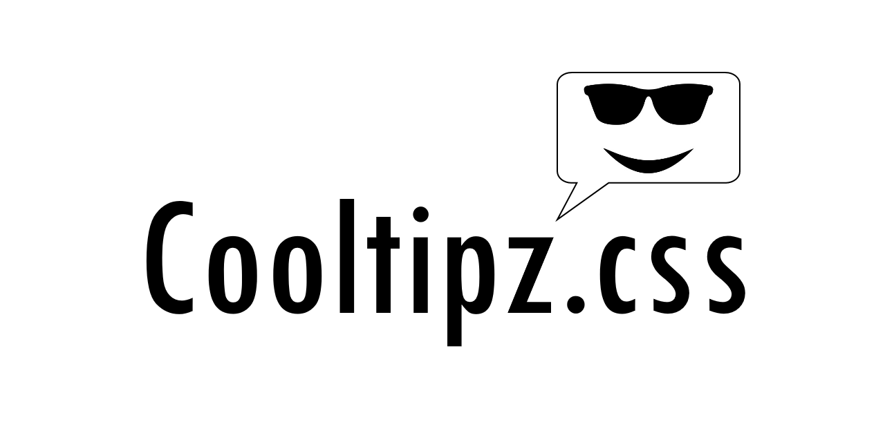
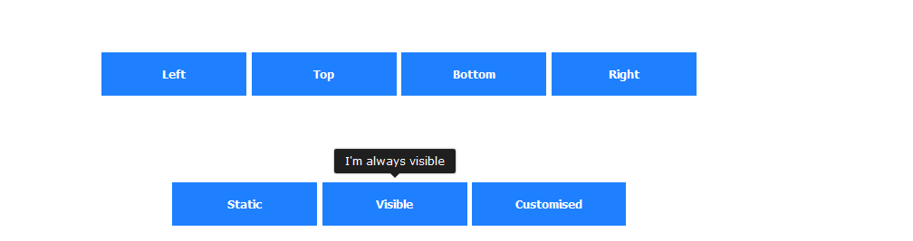

---

# Cooltipz.css - Cool tooltips

**Cool tooltips made from simple, pure CSS**

**Current version** - [v1.3.0](https://github.com/JDomleo/Cooltipz.css/releases/tag/v1.3.0)

[Read the docs here](https://cooltipz.jackdomleo.dev)

Have a play with Cooltipz.css in [CodePen](https://codepen.io/JackDomleo/pen/mderEeG).

**Features**
- Easy and simple
- Pure CSS, no JavaScript
- Accessible with aria-label attributes
- Options to use classes or `data-` attributes
- Disables animation if user's preference are set to reduced motion - [`prefers-reduced-motion`](https://developer.mozilla.org/en-US/docs/Web/CSS/@media/prefers-reduced-motion)
- Uses [Autoprefixer](https://github.com/postcss/autoprefixer) when generating the distributed CSS
- Import expanded CSS, minified CSS or the the raw Sass/SCSS

---

## Examples



---

## Installation

### Stylesheet

Link to CDN stylesheet in your `<head>`
```html
<!-- This will always get the latest expanded stylesheet -->
<link rel="stylesheet" href="https://raw.githack.com/JDomleo/Cooltipz.css/master/cooltipz.css" />

<!-- This will always get the latest minified stylesheet -->
<link rel="stylesheet" href="https://raw.githack.com/JDomleo/Cooltipz.css/master/cooltipz.min.css" />
```

Link to CDN stylesheet in you CSS
```css
/* This will always get the latest expanded stylesheet */
@import url(https://raw.githack.com/JDomleo/Cooltipz.css/master/cooltipz.css);

/* This will always get the latest minified stylesheet */
@import url(https://raw.githack.com/JDomleo/Cooltipz.css/master/cooltipz.min.css);
```

Download it from GitHub and link to it locally
```html
<!-- This will never be updated, unless manually changed -->
<link rel="stylesheet" href="path/to/cooltipz.min.css" />
```

### npm

Install via npm
```
npm install cooltipz-css --save
```

Import into your JavaScript
```js
import 'cooltipz-css';
```

Or import into your Sass/SCSS
```scss
/* Webpack */
@import '~cooltipz-css/src/cooltipz';

/* Non-webpack */
@import 'path/to/node_modules/cooltipz-css/src/cooltipz';
```

---

## Contributors

<a href="https://github.com/JDomleo/Cooltipz.css/graphs/contributors">
  
</a>

---

[npm](https://www.npmjs.com/package/cooltipz-css) &bull; [GitHub](https://github.com/JDomleo/Cooltipz.css) &bull; [docs](https://cooltipz.jackdomleo.dev) &bull; [CHANGELOG](https://github.com/JDomleo/Cooltipz.css/releases)