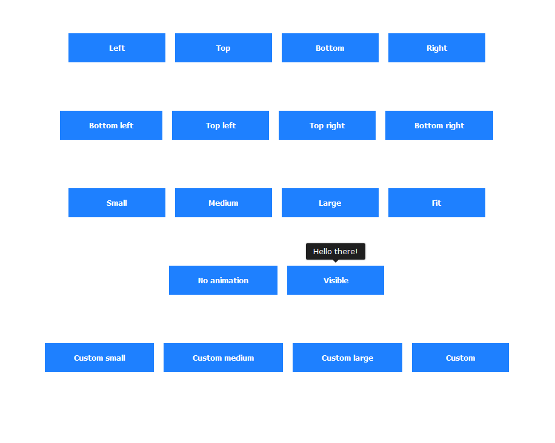

<div align="center">

  

  [](https://github.com/jackdomleo7/Cooltipz.css/actions/workflows/pipeline.yml)

  [](https://github.com/jackdomleo7/Cooltipz.css#license "Read license") [](https://github.com/jackdomleo7/Cooltipz.css/blob/master/cooltipz.min.css "File size - Brotli")

  [](https://github.com/jackdomleo7/Cooltipz.css/stargazers "Total GitHub stars") [](https://github.com/jackdomleo7/Cooltipz.css/releases "Current version/release") [](https://www.npmjs.com/package/cooltipz-css "Monthly npm downloads") [](https://www.jsdelivr.com/package/npm/cooltipz-css)

</div>

---

# Cooltipz.css - Cool tooltips

**Cool customisable tooltips made from pure CSS**

_Lightweight &bull; Accessible &bull; Customisable &bull; Simple_

Cooltipz.css is a pure CSS tooltip library that is lightweight, modern, accessible, customisable and easy to use.

Official documentation: [cooltipz.jackdomleo.dev](https://cooltipz.jackdomleo.dev).

Play with Cooltipz.css on [CodePen](https://codepen.io/JackDomleo/pen/mderEeG).

**Features**
- Easy and simple tooltips with **quick setup**
- Pure CSS, no JavaScript
- Highly customisable
- **Multiple versions available** - Combined, data attributes only, or classes only for optimal bundle size
- **Internationalisation support** - Full RTL language support and modern CSS logical properties for global accessibility
- Accessible with `aria-label` attributes
- Automatically disables animation if the user [prefers reduced motion](https://developer.mozilla.org/en-US/docs/Web/CSS/@media/prefers-reduced-motion?ref=cooltipz.jackdomleo.dev)
- Options to use classes or `data-` attributes
- Options to import via CDN, npm or yarn
- Options to import SCSS <sub><sup>(npm &amp; yarn only)</sup></sub> or CSS stylesheets <sub><sup>(expanded or minified)</sup></sub>
- Supports a wide range of characters and languages (including emojis, [Font Awesome 4](https://fontawesome.com/v4.7.0?ref=cooltipz.jackdomleo.dev) and [Font Awesome 5](https://fontawesome.com?ref=cooltipz.jackdomleo.dev) icons)
- Uses [Autoprefixer](https://github.com/postcss/autoprefixer?ref=cooltipz.jackdomleo.dev) when generating the CSS stylesheets and [cssnano](https://github.com/cssnano/cssnano?ref=cooltipz.jackdomleo.dev) to minify the minified stylesheet

---

## Examples



---

## Usage

### CDN

Cooltipz.css is available in three versions:
- **Combined** (`cooltipz.css`/`cooltipz.min.css`) - Full version supporting both data attributes and classes
- **Data attributes only** (`cooltipz-data-attrs.css`/`cooltipz-data-attrs.min.css`) - Lighter version for data-attribute usage only
- **Classes only** (`cooltipz-classes.css`/`cooltipz-classes.min.css`) - Lighter version for class-based usage only

Choose the version that best fits your needs to minimize bundle size.

In the below CDN links:
- Replace `:version` with a version [listed here](https://www.npmjs.com/package/cooltipz-css?activeTab=versions) (latest version is always recommended). If you always want to get the latest stylesheet, remove `@:version` completely (Not recommended).
- Replace `:file` with one of the below:
  
  **Combined (full functionality - 3.13kB when compressed):**
  - `cooltipz.css` <sub><sup>(Expanded stylesheet)</sup></sub>
  - `cooltipz.min.css` <sub><sup>(Minified stylesheet)</sup></sub>
  
  **Data attributes only (smaller bundle - 1.88kB when compressed):**
  - `cooltipz-data-attrs.css` <sub><sup>(Expanded stylesheet)</sup></sub>
  - `cooltipz-data-attrs.min.css` <sub><sup>(Minified stylesheet)</sup></sub>
  
  **Classes only (smaller bundle - 1.85kB when compressed):**
  - `cooltipz-classes.css` <sub><sup>(Expanded stylesheet)</sup></sub>
  - `cooltipz-classes.min.css` <sub><sup>(Minified stylesheet)</sup></sub>

```html
<!-- HTML -->
<link rel="stylesheet" href="https://cdn.jsdelivr.net/npm/cooltipz-css@:version/:file" />
```

```css
/* Or CSS */
@import url('https://cdn.jsdelivr.net/npm/cooltipz-css@:version/:file');
```

### Package manager (npm or yarn)

It's best practice to install Cooltipz.css as a dependency rather than a dev dependency. You can install `cooltipz-css` via **npm** or **yarn**.

_First_ install via **npm**
```
npm install cooltipz-css --save
```

_Or_ install via **yarn**
```
yarn add cooltipz-css
```

_Then_ import into your JavaScript
```js
import 'cooltipz-css';
```

_Or_ use the SCSS or CSS into your Sass/SCSS
In the below example, replace `:file` with one of the options below:

**SCSS source files:**
- `src/cooltipz` <sub><sup>(.scss file - combined version)</sup></sub>
- `src/cooltipz-data-attrs` <sub><sup>(.scss file - data attributes only)</sup></sub>
- `src/cooltipz-classes` <sub><sup>(.scss file - classes only)</sup></sub>

**Compiled CSS files:**
- `cooltipz.css` <sub><sup>(Expanded .css - combined version)</sup></sub>
- `cooltipz.min.css` <sub><sup>(Minified .css - combined version)</sup></sub>
- `cooltipz-data-attrs.css` <sub><sup>(Expanded .css - data attributes only)</sup></sub>
- `cooltipz-data-attrs.min.css` <sub><sup>(Minified .css - data attributes only)</sup></sub>
- `cooltipz-classes.css` <sub><sup>(Expanded .css - classes only)</sup></sub>
- `cooltipz-classes.min.css` <sub><sup>(Minified .css - classes only)</sup></sub>
```scss
/* Webpack */
@use '~cooltipz-css/:file' as *;

/* Non-webpack */
@use 'path/to/node_modules/cooltipz-css/:file' as *;
```

---

## Choosing the Right Version

Cooltipz.css offers three different versions to help you optimize your bundle size:

### 🎯 **Combined Version** (Default)
- **Files:** `cooltipz.css`, `cooltipz.min.css`, `src/cooltipz.scss`
- **Use when:** You want to use both data attributes and classes in your project
- **Supports:** Both `data-cooltipz="tooltip text"` and `aria-label="tooltip text"` with classes like `.cooltipz--top`
- **Size:** Full feature set

### 📊 **Data Attributes Only** 
- **Files:** `cooltipz-data-attrs.css`, `cooltipz-data-attrs.min.css`, `src/cooltipz-data-attrs.scss`
- **Use when:** You only use data attributes like `data-cooltipz="tooltip text"` and `data-cooltipz-dir="top"`
- **Supports:** Only data attribute syntax
- **Size:** ~40% smaller than combined version
- **Example:** `<button data-cooltipz="Save file" data-cooltipz-dir="top">Save</button>`

### 🎨 **Classes Only**
- **Files:** `cooltipz-classes.css`, `cooltipz-classes.min.css`, `src/cooltipz-classes.scss`  
- **Use when:** You prefer semantic CSS classes with `aria-label` attributes
- **Supports:** Only class-based syntax with `aria-label`
- **Size:** ~40% smaller than combined version
- **Example:** `<button aria-label="Save file" class="cooltipz--top">Save</button>`

> 💡 **Recommendation:** Start with the **data attributes only** version if you're unsure, as it provides the most intuitive API. You can always switch to the combined version later if needed.

---

## License

Type - **MIT**

[Read license](https://github.com/jackdomleo7/Cooltipz.css/blob/master/LICENSE)

You have the right to use this library in any project FREE of charge for personal and commercial use.

You **do not** have the right to resell, sublicense or redistribute (even for free) this library.

Cooltipz.css is licensed under MIT. As a minimum, you are required to KEEP AND NOT REMOVE the following code at the beginning of your downloaded/installed Cooltipz.css CSS, where `:version` is replaced with the version number you are using:
```css
/*! Cooltipz.css v:version | MIT License | github.com/jackdomleo7/Cooltipz.css */
```

---

## Feedback and support

We appreciate any feedback, good or bad and are always looking for new ideas to improve the user experience (UX), developer experience (DX) and accessibility of the tooltips. You may want to consider:
- Raising a [GitHub issue](https://github.com/jackdomleo7/Cooltipz.css/issues)
- Contacting the [author](https://jackdomleo.dev?ref=cooltipz.jackdomleo.dev) directly
- Starring the [GitHub repository](https://github.com/jackdomleo7/Cooltipz.css)
- Giving the [CodePen](https://codepen.io/JackDomleo/pen/mderEeG) a like
- Mentioning '[Cooltipz.css](https://cooltipz.jackdomleo.dev)' in a README or footer
- Share on social media

---

## Development

### Setup

- Fork this repository if required
- `git clone https://github.com/jackdomleo7/Cooltipz.css.git` or clone your forked repository
- `cd Cooltipz.css`
- `npm ci`
- `npm run build` to compile all versions (combined, data-attrs, and classes) from SCSS to CSS

**Build commands:**
- `npm run build` - Build all three versions
- `npm run build:combined` - Build only the combined version (default)
- `npm run build:data-attrs` - Build only the data attributes version
- `npm run build:classes` - Build only the classes version

### Branch

- All branches should be prefixed with the issue number
- All branches must have a descriptive name

---

[GitHub](https://github.com/jackdomleo7/Cooltipz.css "View the GitHub repo and maybe give us a star") &bull; [npm](https://www.npmjs.com/package/cooltipz-css "View Cooltipz.css on npmjs.com") &bull; [yarn](https://yarnpkg.com/package/cooltipz-css "View Cooltipz.css on yarnpkg.com") &bull; [docs](https://cooltipz.jackdomleo.dev "Read the official documentation") &bull; [CHANGELOG](https://github.com/jackdomleo7/Cooltipz.css/releases "Read all the releases") &bull; [License](https://github.com/jackdomleo7/Cooltipz.css#license "MIT License")
